# Architecture Diagrams

**Version:** 1.0
**Date:** 2026-02-22
**Author:** Architecture Team

This document contains visual representations of the Weakup architecture using Mermaid diagrams.

---

## Table of Contents

1. [Component Architecture](#component-architecture)
2. [Data Flow Diagrams](#data-flow-diagrams)
3. [Sequence Diagrams](#sequence-diagrams)
4. [Class Diagrams](#class-diagrams)
5. [State Diagrams](#state-diagrams)

---

## Component Architecture

### High-Level System Architecture

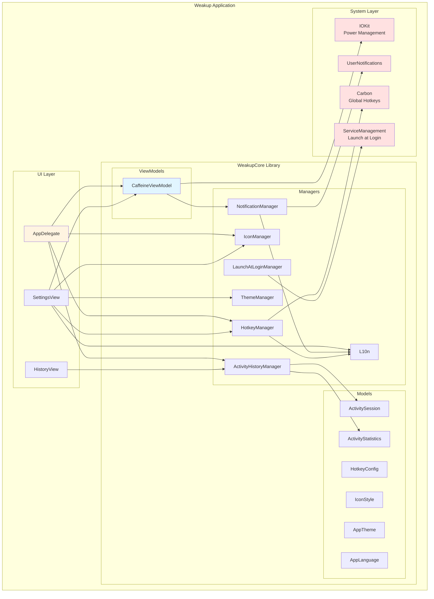
```mermaid
graph TB
    subgraph "Weakup Application"
        subgraph "UI Layer"
            APP[AppDelegate]
            SETTINGS[SettingsView]
            HISTORY[HistoryView]
        end

        subgraph "WeakupCore Library"
            subgraph "ViewModels"
                VM[CaffeineViewModel]
            end

            subgraph "Managers"
                HIST[ActivityHistoryManager]
                NOTIF[NotificationManager]
                HOTKEY[HotkeyManager]
                ICON[IconManager]
                THEME[ThemeManager]
                LAUNCH[LaunchAtLoginManager]
                L10N[L10n]
            end

            subgraph "Models"
                SESSION[ActivitySession]
                STATS[ActivityStatistics]
                HKCONFIG[HotkeyConfig]
                ICONSTYLE[IconStyle]
                APPTHEME[AppTheme]
                LANG[AppLanguage]
            end
        end

        subgraph "System Layer"
            IOKIT[IOKit<br/>Power Management]
            CARBON[Carbon<br/>Global Hotkeys]
            UNNOTIF[UserNotifications]
            SVCMGMT[ServiceManagement<br/>Launch at Login]
        end
    end

    APP --> VM
    APP --> HIST
    APP --> ICON
    APP --> HOTKEY
    SETTINGS --> VM
    SETTINGS --> THEME
    SETTINGS --> ICON
    SETTINGS --> L10N
    SETTINGS --> HOTKEY
    HISTORY --> HIST

    VM --> NOTIF
    VM --> IOKIT
    NOTIF --> L10N
    NOTIF --> UNNOTIF
    HOTKEY --> CARBON
    HOTKEY --> L10N
    LAUNCH --> SVCMGMT
    HIST --> SESSION
    HIST --> STATS

    style VM fill:#e1f5ff
    style APP fill:#fff4e1
    style IOKIT fill:#ffe1e1
    style CARBON fill:#ffe1e1
    style UNNOTIF fill:#ffe1e1
    style SVCMGMT fill:#ffe1e1
```

### Module Dependencies

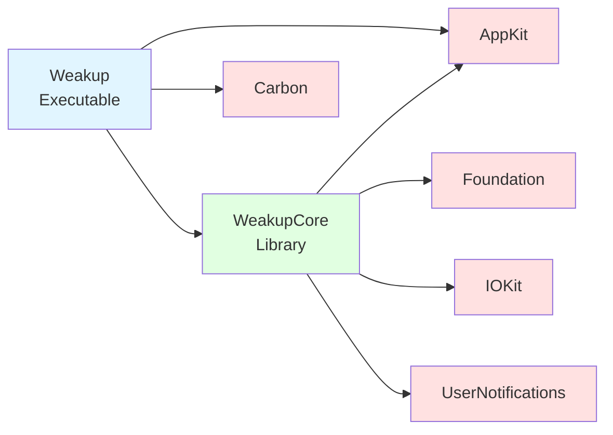
```mermaid
graph LR
    WEAKUP[Weakup<br/>Executable]
    CORE[WeakupCore<br/>Library]
    APPKIT[AppKit]
    FOUNDATION[Foundation]
    IOKIT[IOKit]
    CARBON[Carbon]
    UNNOTIF[UserNotifications]

    WEAKUP --> CORE
    WEAKUP --> APPKIT
    WEAKUP --> CARBON
    CORE --> APPKIT
    CORE --> FOUNDATION
    CORE --> IOKIT
    CORE --> UNNOTIF

    style WEAKUP fill:#e1f5ff
    style CORE fill:#e1ffe1
    style APPKIT fill:#ffe1e1
    style FOUNDATION fill:#ffe1e1
    style IOKIT fill:#ffe1e1
    style CARBON fill:#ffe1e1
    style UNNOTIF fill:#ffe1e1
```

---

## Data Flow Diagrams

### Sleep Prevention Flow

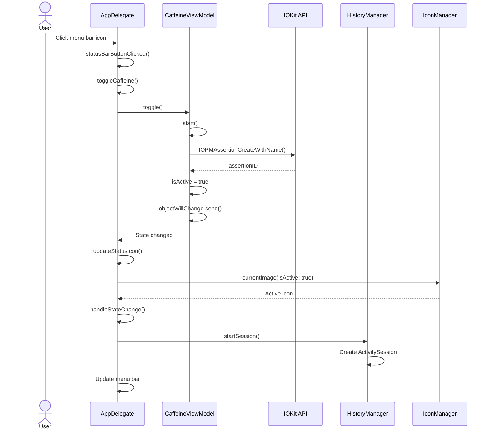
```mermaid
sequenceDiagram
    actor User
    participant UI as AppDelegate
    participant VM as CaffeineViewModel
    participant IOKit as IOKit API
    participant Hist as HistoryManager
    participant Icon as IconManager

    User->>UI: Click menu bar icon
    UI->>UI: statusBarButtonClicked()
    UI->>UI: toggleCaffeine()
    UI->>VM: toggle()
    VM->>VM: start()
    VM->>IOKit: IOPMAssertionCreateWithName()
    IOKit-->>VM: assertionID
    VM->>VM: isActive = true
    VM->>VM: objectWillChange.send()
    VM-->>UI: State changed
    UI->>UI: updateStatusIcon()
    UI->>Icon: currentImage(isActive: true)
    Icon-->>UI: Active icon
    UI->>UI: handleStateChange()
    UI->>Hist: startSession()
    Hist->>Hist: Create ActivitySession
    UI->>UI: Update menu bar
```

### Timer Countdown Flow

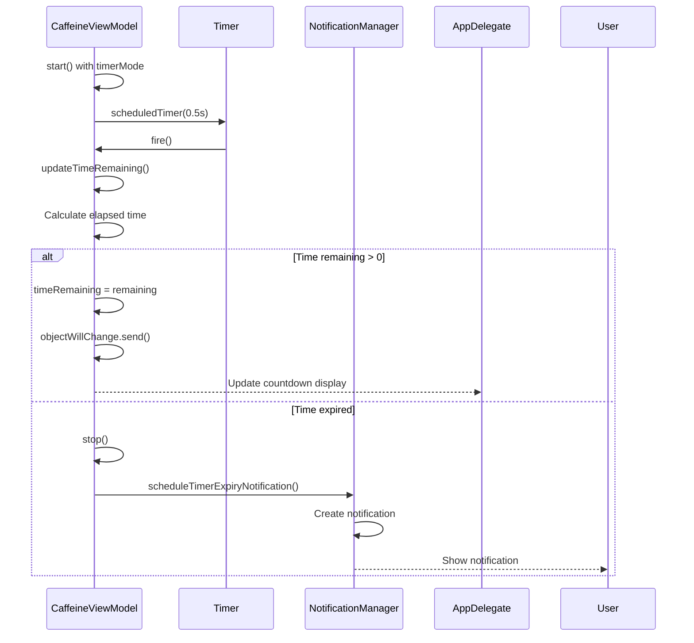
```mermaid
sequenceDiagram
    participant VM as CaffeineViewModel
    participant Timer as Timer
    participant Notif as NotificationManager
    participant UI as AppDelegate

    VM->>VM: start() with timerMode
    VM->>Timer: scheduledTimer(0.5s)
    Timer->>VM: fire()
    VM->>VM: updateTimeRemaining()
    VM->>VM: Calculate elapsed time
    alt Time remaining > 0
        VM->>VM: timeRemaining = remaining
        VM->>VM: objectWillChange.send()
        VM-->>UI: Update countdown display
    else Time expired
        VM->>VM: stop()
        VM->>Notif: scheduleTimerExpiryNotification()
        Notif->>Notif: Create notification
        Notif-->>User: Show notification
    end
```

### Localization Flow

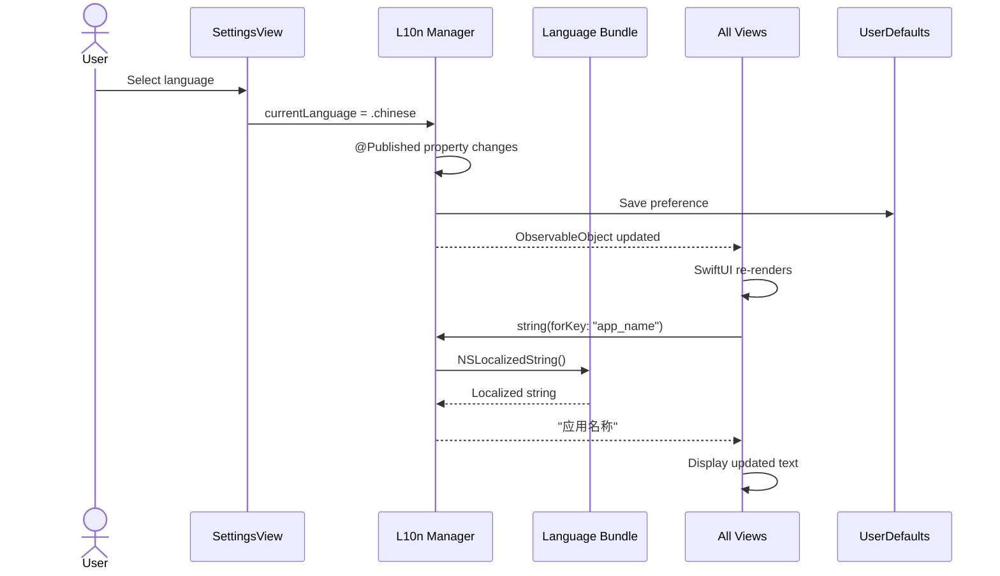
```mermaid
sequenceDiagram
    actor User
    participant Settings as SettingsView
    participant L10n as L10n Manager
    participant Bundle as Language Bundle
    participant UI as All Views

    User->>Settings: Select language
    Settings->>L10n: currentLanguage = .chinese
    L10n->>L10n: @Published property changes
    L10n->>UserDefaults: Save preference
    L10n-->>UI: ObservableObject updated
    UI->>UI: SwiftUI re-renders
    UI->>L10n: string(forKey: "app_name")
    L10n->>Bundle: NSLocalizedString()
    Bundle-->>L10n: Localized string
    L10n-->>UI: "应用名称"
    UI->>UI: Display updated text
```

### Notification Action Flow

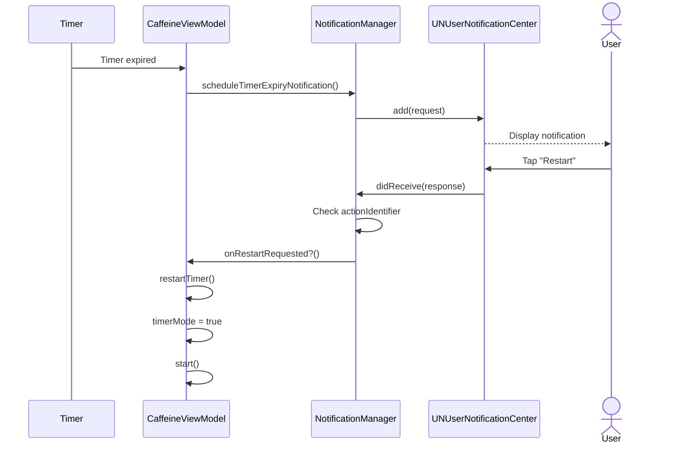
```mermaid
sequenceDiagram
    participant Timer as Timer
    participant VM as CaffeineViewModel
    participant Notif as NotificationManager
    participant UNCenter as UNUserNotificationCenter
    actor User

    Timer->>VM: Timer expired
    VM->>Notif: scheduleTimerExpiryNotification()
    Notif->>UNCenter: add(request)
    UNCenter-->>User: Display notification
    User->>UNCenter: Tap "Restart"
    UNCenter->>Notif: didReceive(response)
    Notif->>Notif: Check actionIdentifier
    Notif->>VM: onRestartRequested?()
    VM->>VM: restartTimer()
    VM->>VM: timerMode = true
    VM->>VM: start()
```

---

## Sequence Diagrams

### App Launch Sequence

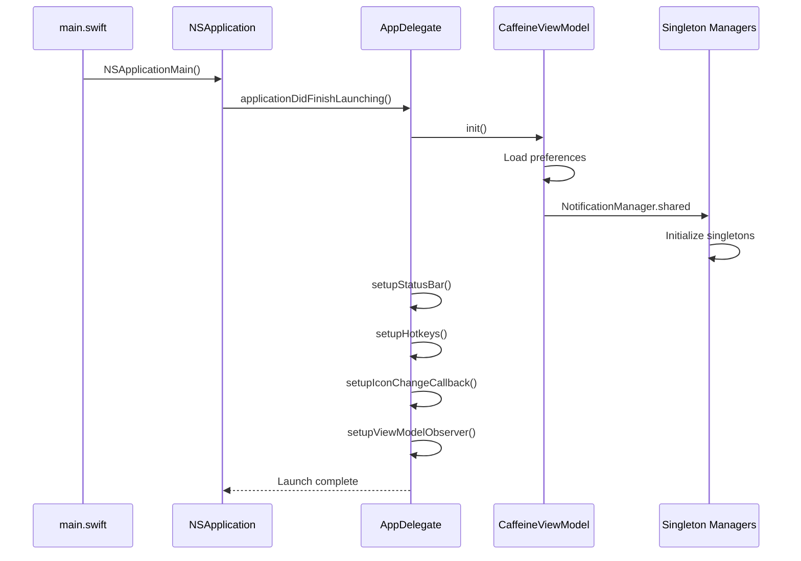
```mermaid
sequenceDiagram
    participant Main as main.swift
    participant App as NSApplication
    participant Delegate as AppDelegate
    participant VM as CaffeineViewModel
    participant Managers as Singleton Managers

    Main->>App: NSApplicationMain()
    App->>Delegate: applicationDidFinishLaunching()
    Delegate->>VM: init()
    VM->>VM: Load preferences
    VM->>Managers: NotificationManager.shared
    Managers->>Managers: Initialize singletons
    Delegate->>Delegate: setupStatusBar()
    Delegate->>Delegate: setupHotkeys()
    Delegate->>Delegate: setupIconChangeCallback()
    Delegate->>Delegate: setupViewModelObserver()
    Delegate-->>App: Launch complete
```

### Settings Window Flow

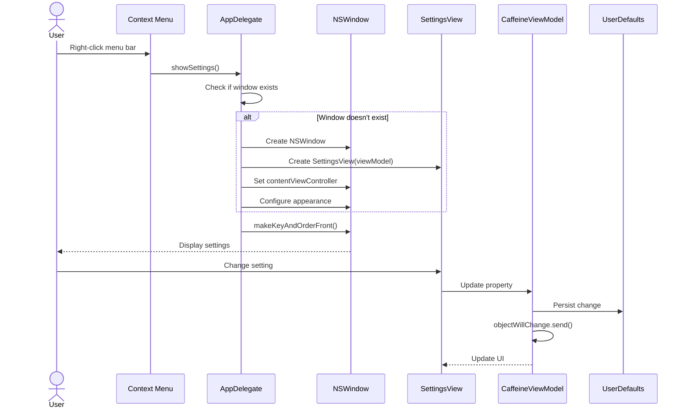
```mermaid
sequenceDiagram
    actor User
    participant Menu as Context Menu
    participant Delegate as AppDelegate
    participant Window as NSWindow
    participant Settings as SettingsView
    participant VM as CaffeineViewModel

    User->>Menu: Right-click menu bar
    Menu->>Delegate: showSettings()
    Delegate->>Delegate: Check if window exists
    alt Window doesn't exist
        Delegate->>Window: Create NSWindow
        Delegate->>Settings: Create SettingsView(viewModel)
        Delegate->>Window: Set contentViewController
        Delegate->>Window: Configure appearance
    end
    Delegate->>Window: makeKeyAndOrderFront()
    Window-->>User: Display settings
    User->>Settings: Change setting
    Settings->>VM: Update property
    VM->>UserDefaults: Persist change
    VM->>VM: objectWillChange.send()
    VM-->>Settings: Update UI
```

### Hotkey Registration Flow

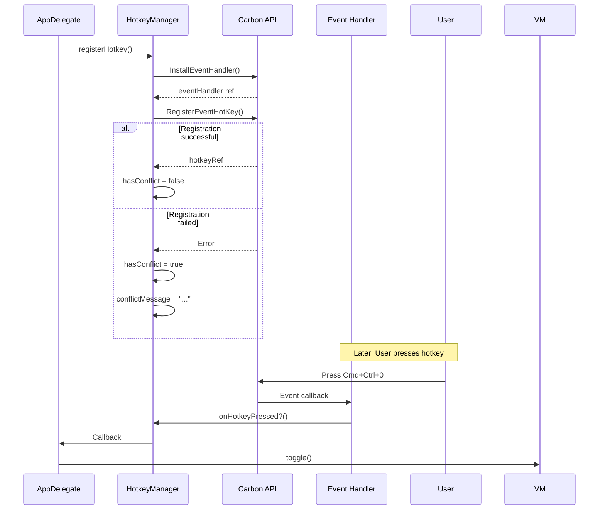
```mermaid
sequenceDiagram
    participant Delegate as AppDelegate
    participant HKMgr as HotkeyManager
    participant Carbon as Carbon API
    participant Handler as Event Handler

    Delegate->>HKMgr: registerHotkey()
    HKMgr->>Carbon: InstallEventHandler()
    Carbon-->>HKMgr: eventHandler ref
    HKMgr->>Carbon: RegisterEventHotKey()
    alt Registration successful
        Carbon-->>HKMgr: hotkeyRef
        HKMgr->>HKMgr: hasConflict = false
    else Registration failed
        Carbon-->>HKMgr: Error
        HKMgr->>HKMgr: hasConflict = true
        HKMgr->>HKMgr: conflictMessage = "..."
    end

    Note over User,Handler: Later: User presses hotkey
    User->>Carbon: Press Cmd+Ctrl+0
    Carbon->>Handler: Event callback
    Handler->>HKMgr: onHotkeyPressed?()
    HKMgr->>Delegate: Callback
    Delegate->>VM: toggle()
```

---

## Class Diagrams

### CaffeineViewModel Class Diagram

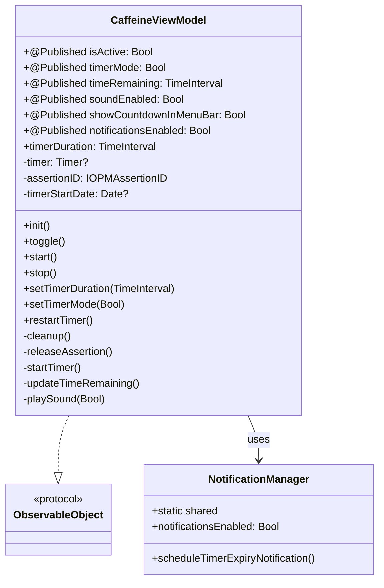
```mermaid
classDiagram
    class CaffeineViewModel {
        +@Published isActive: Bool
        +@Published timerMode: Bool
        +@Published timeRemaining: TimeInterval
        +@Published soundEnabled: Bool
        +@Published showCountdownInMenuBar: Bool
        +@Published notificationsEnabled: Bool
        +timerDuration: TimeInterval
        -timer: Timer?
        -assertionID: IOPMAssertionID
        -timerStartDate: Date?
        +init()
        +toggle()
        +start()
        +stop()
        +setTimerDuration(TimeInterval)
        +setTimerMode(Bool)
        +restartTimer()
        -cleanup()
        -releaseAssertion()
        -startTimer()
        -updateTimeRemaining()
        -playSound(Bool)
    }

    class ObservableObject {
        <<protocol>>
    }

    class NotificationManager {
        +static shared
        +notificationsEnabled: Bool
        +scheduleTimerExpiryNotification()
    }

    CaffeineViewModel ..|> ObservableObject
    CaffeineViewModel --> NotificationManager : uses
```

### Manager Hierarchy

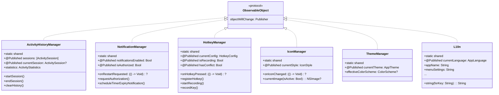
```mermaid
classDiagram
    class ObservableObject {
        <<protocol>>
        objectWillChange: Publisher
    }

    class ActivityHistoryManager {
        +static shared
        +@Published sessions: [ActivitySession]
        +@Published currentSession: ActivitySession?
        +startSession()
        +endSession()
        +clearHistory()
        +statistics: ActivityStatistics
    }

    class NotificationManager {
        +static shared
        +@Published notificationsEnabled: Bool
        +@Published isAuthorized: Bool
        +onRestartRequested: (() -> Void)?
        +requestAuthorization()
        +scheduleTimerExpiryNotification()
    }

    class HotkeyManager {
        +static shared
        +@Published currentConfig: HotkeyConfig
        +@Published isRecording: Bool
        +@Published hasConflict: Bool
        +onHotkeyPressed: (() -> Void)?
        +registerHotkey()
        +startRecording()
        +recordKey()
    }

    class IconManager {
        +static shared
        +@Published currentStyle: IconStyle
        +onIconChanged: (() -> Void)?
        +currentImage(isActive: Bool): NSImage?
    }

    class ThemeManager {
        +static shared
        +@Published currentTheme: AppTheme
        +effectiveColorScheme: ColorScheme?
    }

    class L10n {
        +static shared
        +@Published currentLanguage: AppLanguage
        +string(forKey: String): String
        +appName: String
        +menuSettings: String
        ...
    }

    ObservableObject <|.. ActivityHistoryManager
    ObservableObject <|.. NotificationManager
    ObservableObject <|.. HotkeyManager
    ObservableObject <|.. IconManager
    ObservableObject <|.. ThemeManager
    ObservableObject <|.. L10n
```

### Model Relationships

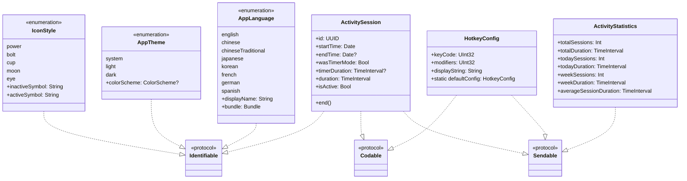
```mermaid
classDiagram
    class ActivitySession {
        +id: UUID
        +startTime: Date
        +endTime: Date?
        +wasTimerMode: Bool
        +timerDuration: TimeInterval?
        +duration: TimeInterval
        +isActive: Bool
        +end()
    }

    class ActivityStatistics {
        +totalSessions: Int
        +totalDuration: TimeInterval
        +todaySessions: Int
        +todayDuration: TimeInterval
        +weekSessions: Int
        +weekDuration: TimeInterval
        +averageSessionDuration: TimeInterval
    }

    class HotkeyConfig {
        +keyCode: UInt32
        +modifiers: UInt32
        +displayString: String
        +static defaultConfig: HotkeyConfig
    }

    class IconStyle {
        <<enumeration>>
        power
        bolt
        cup
        moon
        eye
        +inactiveSymbol: String
        +activeSymbol: String
    }

    class AppTheme {
        <<enumeration>>
        system
        light
        dark
        +colorScheme: ColorScheme?
    }

    class AppLanguage {
        <<enumeration>>
        english
        chinese
        chineseTraditional
        japanese
        korean
        french
        german
        spanish
        +displayName: String
        +bundle: Bundle
    }

    class Identifiable {
        <<protocol>>
    }

    class Codable {
        <<protocol>>
    }

    class Sendable {
        <<protocol>>
    }

    ActivitySession ..|> Identifiable
    ActivitySession ..|> Codable
    ActivitySession ..|> Sendable
    ActivityStatistics ..|> Sendable
    HotkeyConfig ..|> Codable
    HotkeyConfig ..|> Sendable
    IconStyle ..|> Identifiable
    AppTheme ..|> Identifiable
    AppLanguage ..|> Identifiable
```

---

## State Diagrams

### Caffeine State Machine

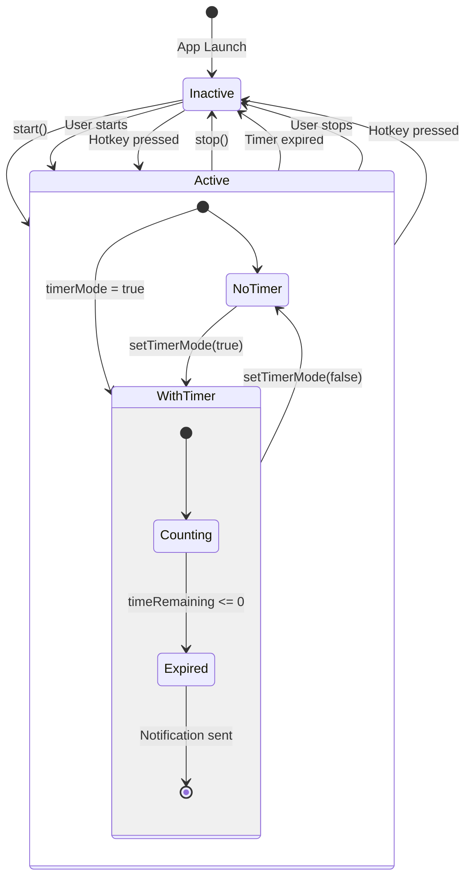
```mermaid
stateDiagram-v2
    [*] --> Inactive: App Launch

    Inactive --> Active: start()
    Active --> Inactive: stop()

    state Active {
        [*] --> NoTimer
        [*] --> WithTimer: timerMode = true

        NoTimer --> WithTimer: setTimerMode(true)
        WithTimer --> NoTimer: setTimerMode(false)

        state WithTimer {
            [*] --> Counting
            Counting --> Expired: timeRemaining <= 0
            Expired --> [*]: Notification sent
        }
    }

    Active --> Inactive: Timer expired
    Active --> Inactive: User stops
    Inactive --> Active: User starts
    Inactive --> Active: Hotkey pressed
    Active --> Inactive: Hotkey pressed
```

### Hotkey Recording State

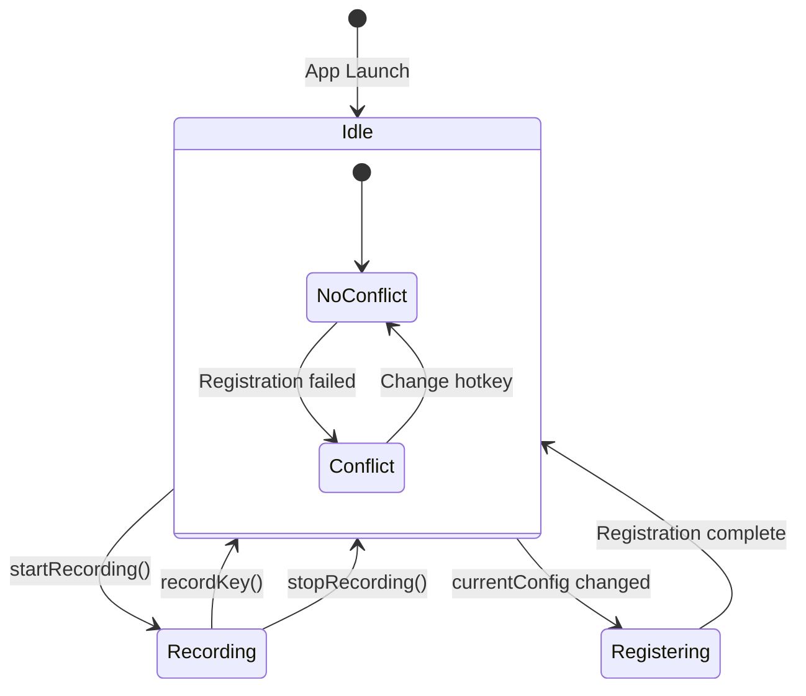
```mermaid
stateDiagram-v2
    [*] --> Idle: App Launch

    Idle --> Recording: startRecording()
    Recording --> Idle: recordKey()
    Recording --> Idle: stopRecording()

    state Idle {
        [*] --> NoConflict
        NoConflict --> Conflict: Registration failed
        Conflict --> NoConflict: Change hotkey
    }

    Idle --> Registering: currentConfig changed
    Registering --> Idle: Registration complete
```

### Notification Permission State

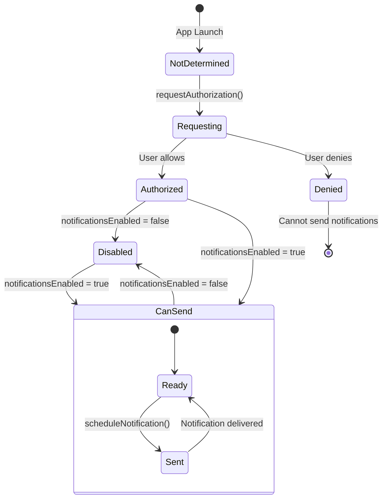
```mermaid
stateDiagram-v2
    [*] --> NotDetermined: App Launch

    NotDetermined --> Requesting: requestAuthorization()
    Requesting --> Authorized: User allows
    Requesting --> Denied: User denies

    Authorized --> CanSend: notificationsEnabled = true
    Authorized --> Disabled: notificationsEnabled = false
    Disabled --> CanSend: notificationsEnabled = true
    CanSend --> Disabled: notificationsEnabled = false

    state CanSend {
        [*] --> Ready
        Ready --> Sent: scheduleNotification()
        Sent --> Ready: Notification delivered
    }

    Denied --> [*]: Cannot send notifications
```

### Activity Session Lifecycle

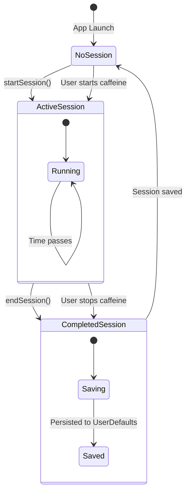
```mermaid
stateDiagram-v2
    [*] --> NoSession: App Launch

    NoSession --> ActiveSession: startSession()
    ActiveSession --> CompletedSession: endSession()
    CompletedSession --> NoSession: Session saved

    state ActiveSession {
        [*] --> Running
        Running --> Running: Time passes
    }

    state CompletedSession {
        [*] --> Saving
        Saving --> Saved: Persisted to UserDefaults
    }

    NoSession --> ActiveSession: User starts caffeine
    ActiveSession --> CompletedSession: User stops caffeine
```

---

## Dependency Injection Architecture (Proposed)

### Current Architecture (Singleton-based)

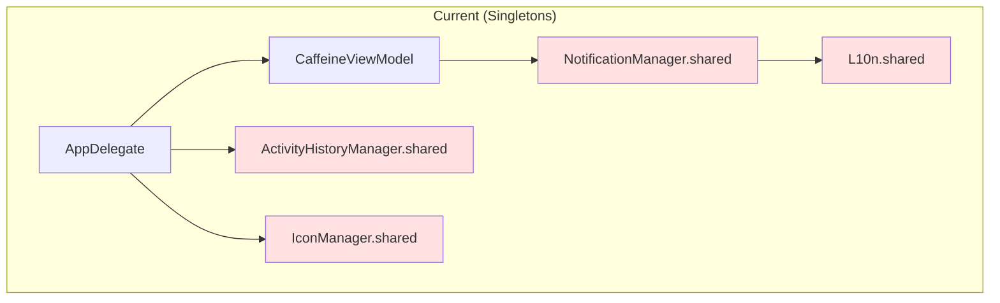
```mermaid
graph TB
    subgraph "Current (Singletons)"
        APP[AppDelegate]
        VM[CaffeineViewModel]
        HIST[ActivityHistoryManager.shared]
        NOTIF[NotificationManager.shared]
        ICON[IconManager.shared]
        L10N[L10n.shared]

        APP --> VM
        APP --> HIST
        APP --> ICON
        VM --> NOTIF
        NOTIF --> L10N
    end

    style HIST fill:#ffe1e1
    style NOTIF fill:#ffe1e1
    style ICON fill:#ffe1e1
    style L10N fill:#ffe1e1
```

### Proposed Architecture (Dependency Injection)

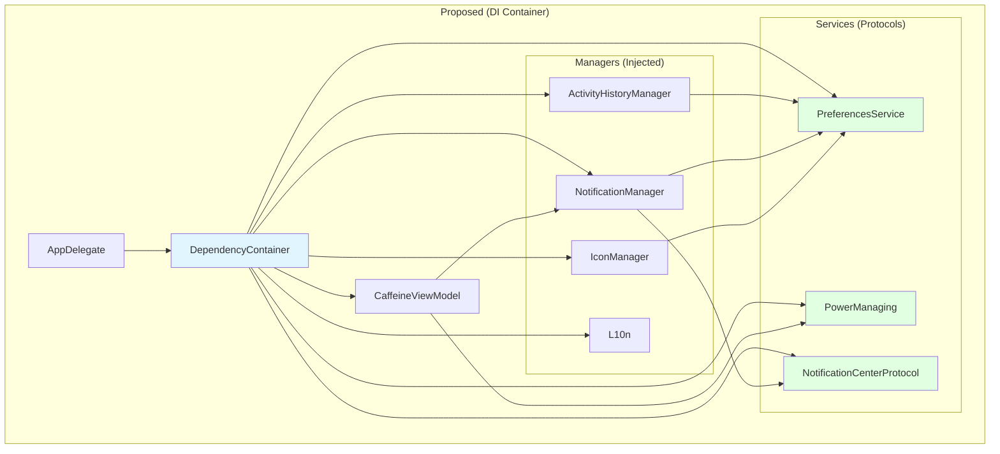
```mermaid
graph TB
    subgraph "Proposed (DI Container)"
        CONTAINER[DependencyContainer]
        APP[AppDelegate]
        VM[CaffeineViewModel]

        subgraph "Services (Protocols)"
            PREFS[PreferencesService]
            POWER[PowerManaging]
            NOTIFCTR[NotificationCenterProtocol]
        end

        subgraph "Managers (Injected)"
            HIST[ActivityHistoryManager]
            NOTIF[NotificationManager]
            ICON[IconManager]
            L10N[L10n]
        end

        CONTAINER --> PREFS
        CONTAINER --> POWER
        CONTAINER --> NOTIFCTR
        CONTAINER --> HIST
        CONTAINER --> NOTIF
        CONTAINER --> ICON
        CONTAINER --> L10N

        APP --> CONTAINER
        CONTAINER --> VM
        VM --> POWER
        VM --> NOTIF
        HIST --> PREFS
        NOTIF --> PREFS
        NOTIF --> NOTIFCTR
        ICON --> PREFS
    end

    style CONTAINER fill:#e1f5ff
    style PREFS fill:#e1ffe1
    style POWER fill:#e1ffe1
    style NOTIFCTR fill:#e1ffe1
```

### Testing Architecture

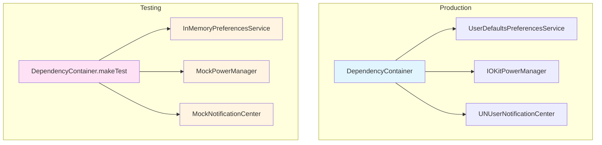
```mermaid
graph TB
    subgraph "Production"
        PROD_CONTAINER[DependencyContainer]
        PROD_PREFS[UserDefaultsPreferencesService]
        PROD_POWER[IOKitPowerManager]
        PROD_NOTIF[UNUserNotificationCenter]

        PROD_CONTAINER --> PROD_PREFS
        PROD_CONTAINER --> PROD_POWER
        PROD_CONTAINER --> PROD_NOTIF
    end

    subgraph "Testing"
        TEST_CONTAINER[DependencyContainer.makeTest]
        MOCK_PREFS[InMemoryPreferencesService]
        MOCK_POWER[MockPowerManager]
        MOCK_NOTIF[MockNotificationCenter]

        TEST_CONTAINER --> MOCK_PREFS
        TEST_CONTAINER --> MOCK_POWER
        TEST_CONTAINER --> MOCK_NOTIF
    end

    style PROD_CONTAINER fill:#e1f5ff
    style TEST_CONTAINER fill:#ffe1f5
    style MOCK_PREFS fill:#fff4e1
    style MOCK_POWER fill:#fff4e1
    style MOCK_NOTIF fill:#fff4e1
```

---

## Performance Considerations

### Timer Update Flow

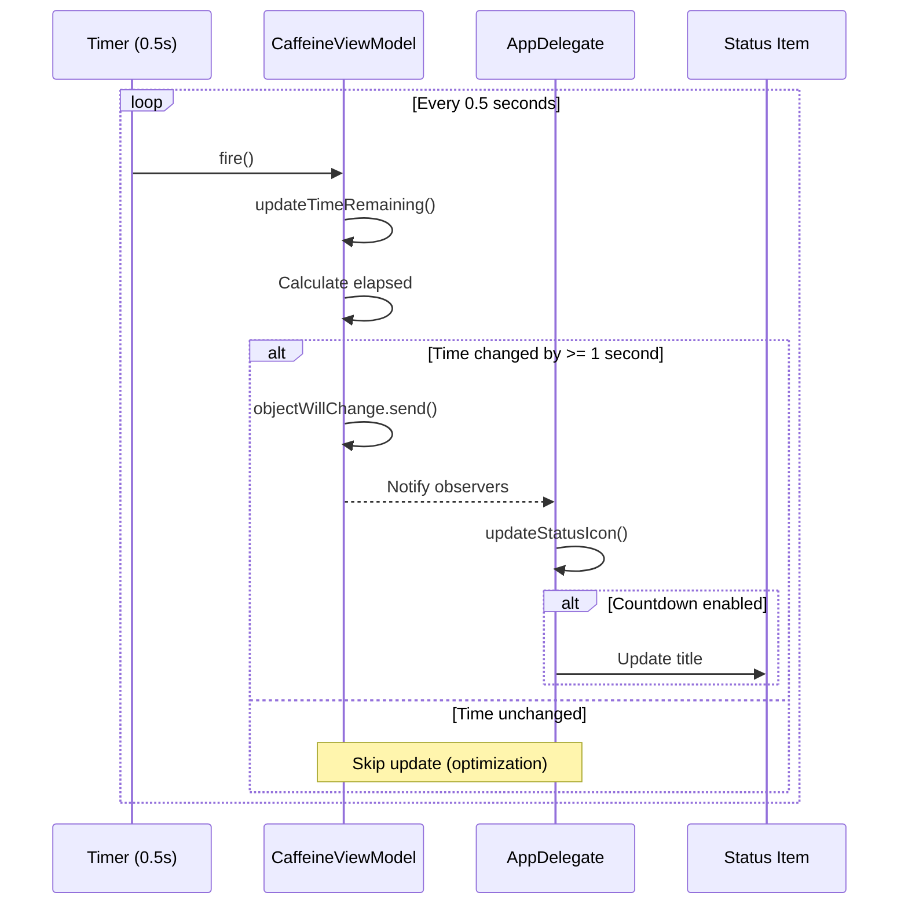
```mermaid
sequenceDiagram
    participant Timer as Timer (0.5s)
    participant VM as CaffeineViewModel
    participant UI as AppDelegate
    participant MenuBar as Status Item

    loop Every 0.5 seconds
        Timer->>VM: fire()
        VM->>VM: updateTimeRemaining()
        VM->>VM: Calculate elapsed
        alt Time changed by >= 1 second
            VM->>VM: objectWillChange.send()
            VM-->>UI: Notify observers
            UI->>UI: updateStatusIcon()
            alt Countdown enabled
                UI->>MenuBar: Update title
            end
        else Time unchanged
            Note over VM,UI: Skip update (optimization)
        end
    end
```

### Memory Management

```mermaid
graph TB
    subgraph "App Lifetime"
        APP[AppDelegate]
        VM[CaffeineViewModel]
        MANAGERS[Singleton Managers]
    end

    subgraph "Session Lifetime"
        WINDOW[Settings Window]
        TIMER[Timer]
        OBSERVER[Combine Observers]
    end

    subgraph "Weak References"
        WEAK_SELF["[weak self]"]
        WEAK_VM["[weak viewModel]"]
    end

    APP --> VM
    APP --> MANAGERS
    APP --> WINDOW
    VM --> TIMER
    VM --> OBSERVER

    TIMER -.-> WEAK_SELF
    OBSERVER -.-> WEAK_VM

    style WEAK_SELF fill:#fff4e1
    style WEAK_VM fill:#fff4e1
```

---

## Conclusion

These diagrams provide visual representations of:

1. **Component Architecture**: How modules and components are organized
2. **Data Flow**: How data moves through the system
3. **Sequence Diagrams**: Step-by-step interactions
4. **Class Diagrams**: Object relationships and hierarchies
5. **State Diagrams**: State transitions and lifecycles

Use these diagrams for:
- Onboarding new developers
- Planning new features
- Understanding system behavior
- Identifying refactoring opportunities
- Documentation and communication
